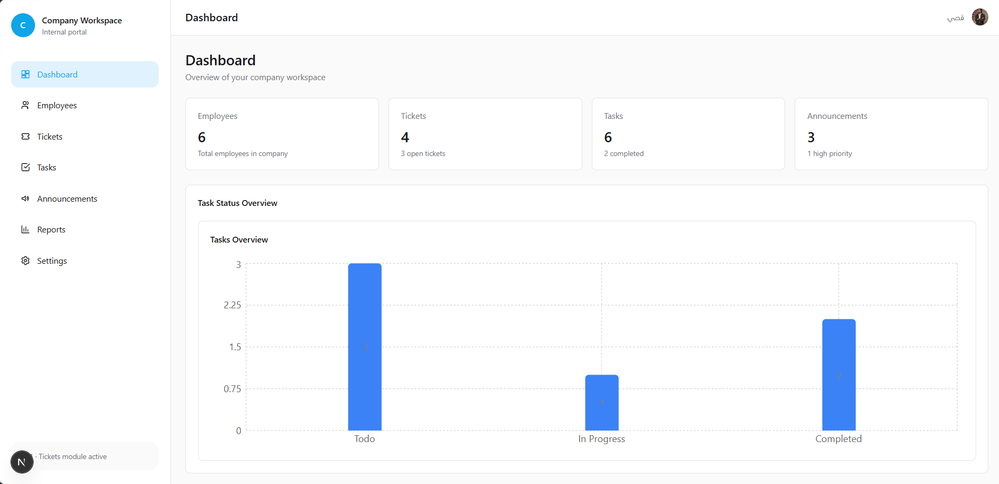
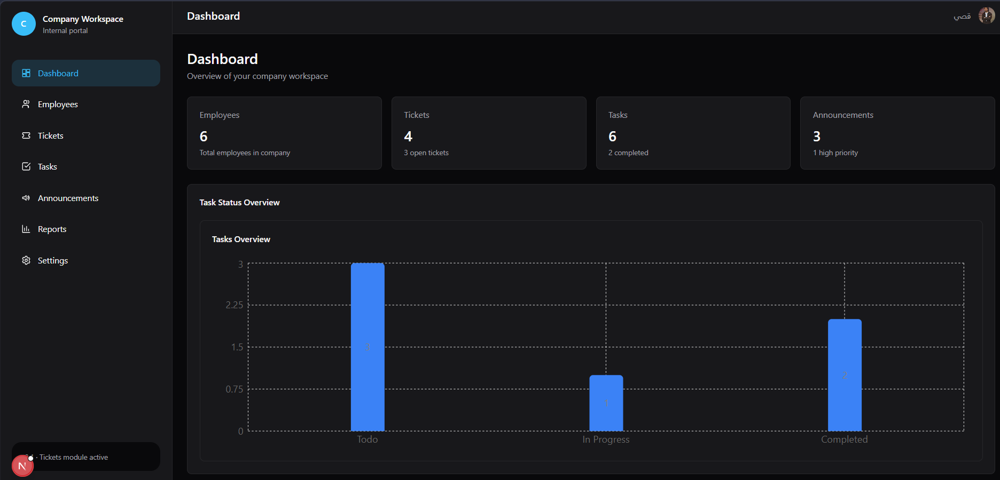
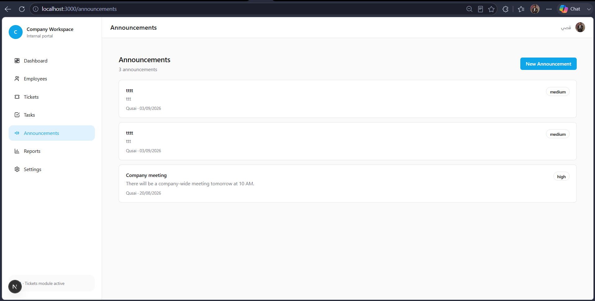
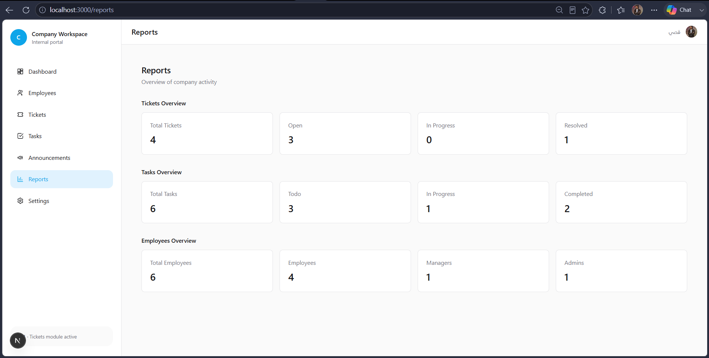
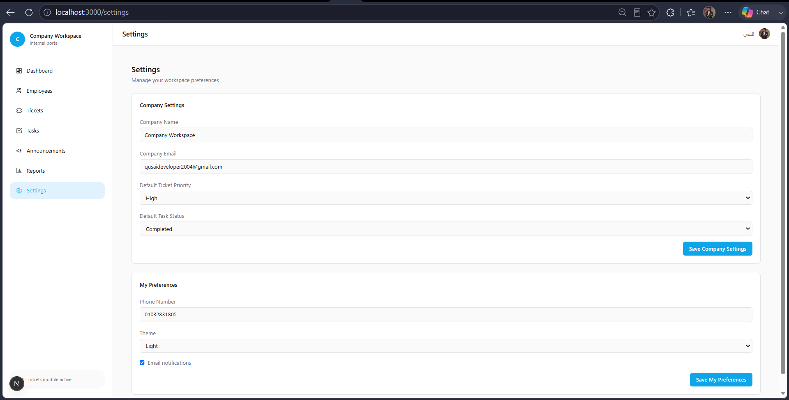

# Company Workspace

An internal company portal for managing employees, support tickets, tasks, announcements, company settings, and reports.

It uses role-based access control so that admins, managers, and employees only see and perform the actions allowed for their role and department.

## Demo Account

Use this shared account to explore the protected workspace:

- Email: `companyworkspace@gmail.com`
- Password: `DemoTestApp2004`
  git status
  > This is a shared demo account with limited Admin permissions.
  > Do not add sensitive or personal information.

## Live Demo

[Open the live demo](https://company-workspace-beta.vercel.app/)

## Screenshots

<!-- Add screenshots here after uploading image files to Images-Project/. -->












## Features

- Clerk authentication linked to Employee records in Neon PostgreSQL.
- Protected dashboard access for linked, active employees only.
- Employee management with role, department, and account-status rules.
- Ticket management with role-aware visibility and automatic creator linking.
- Task management with department-aware assignment and permissions.
- Announcement creation and moderation rules for admins and managers.
- Company defaults for ticket priority and task status.
- Company settings for admins and personal preferences for each employee.
- Persisted light, dark, and system theme preferences.
- Role-aware dashboard and reports based on visible data.
- Responsive navigation for desktop and mobile screens.

## Permission Summary

| Module           | Admin                  | Manager                                                       | Employee                         |
| ---------------- | ---------------------- | ------------------------------------------------------------- | -------------------------------- |
| Employees        | Full management        | Create/update eligible employees in own department; no delete | View list only                   |
| Tickets          | Manage all             | Manage own-department tickets                                 | Manage only own tickets          |
| Tasks            | Manage all             | Manage own-department tasks                                   | Update only assigned task status |
| Announcements    | Create, update, delete | Create and update                                             | Read only                        |
| Company Settings | Manage                 | View personal preferences                                     | View personal preferences        |

Inactive employees and Clerk accounts without a linked Employee record cannot access the workspace or complete protected operations.

## Tech Stack

- [Next.js](https://nextjs.org/) 16 with the App Router
- [React](https://react.dev/) 19 and [TypeScript](https://www.typescriptlang.org/)
- [Tailwind CSS](https://tailwindcss.com/) for styling
- [Prisma ORM](https://www.prisma.io/) with [Neon PostgreSQL](https://neon.tech/)
- [Clerk](https://clerk.com/) for authentication
- [next-themes](https://github.com/pacocoursey/next-themes) for client theme switching
- [Recharts](https://recharts.org/) for dashboard charts

## Project Structure

```text
app/
├── (dashboard)/          # Protected pages and shared dashboard layout
├── api/                  # Protected route handlers for mutations and data access
├── sign-in/              # Clerk sign-in route
└── unauthorized/         # Access-denied page

components/
├── announcements/        # Announcement forms and actions
├── dashboard/            # Dashboard chart
├── employees/            # Employee form, table, and actions
├── layout/               # Sidebar and responsive navigation
├── settings/             # Settings form
├── tasks/                # Task form and actions
├── theme/                # Theme provider and saved-theme synchronisation
└── tickets/              # Ticket form and actions

lib/
├── modules/              # Prisma data access functions grouped by feature
├── permissions/          # Shared authorization rules
├── current-employee.ts   # Clerk-to-Employee linking helper
├── require-active-employee.ts # Protected-page guard
└── prisma.ts             # Prisma client configuration

prisma/
├── migrations/           # Database migration history
└── schema.prisma         # Database models and enums
```

## Getting Started

### 1. Clone and install

```bash
git clone git@github.com:qusaideveloper2004-hub/Company-Workspace.git
cd Company-Workspace
npm install
```

### 2. Add environment variables

Create `.env` in the project root:

```env
DATABASE_URL="your_neon_database_url"
NEXT_PUBLIC_CLERK_PUBLISHABLE_KEY="your_clerk_publishable_key"
CLERK_SECRET_KEY="your_clerk_secret_key"
```

Never commit `.env` or any secret values.

### 3. Prepare the database and run the app

```bash
npx prisma migrate deploy
npx prisma generate
npm run dev
```

Open [http://localhost:3000](http://localhost:3000).

## Available Scripts

```bash
npm run dev       # Start local development
npm run build     # Generate Prisma Client and create a production build
npm run start     # Run the production build locally
npm run lint      # Run ESLint
```

## Testing and Deployment

See [docs/QA_CHECKLIST.md](./docs/QA_CHECKLIST.md) for the role-permission test matrix and Vercel production smoke test.

For Vercel, configure these Production environment variables:

- `DATABASE_URL`
- `NEXT_PUBLIC_CLERK_PUBLISHABLE_KEY`
- `CLERK_SECRET_KEY`

## Database Models

- `Employee`
- `Ticket`
- `Task`
- `Announcement`
- `CompanySettings`
- `UserPreference`

`Employee.clerkUserId` connects a Clerk account to its Employee record.

## Author

Built by [Qusai Essam](https://github.com/qusaideveloper2004-hub).
