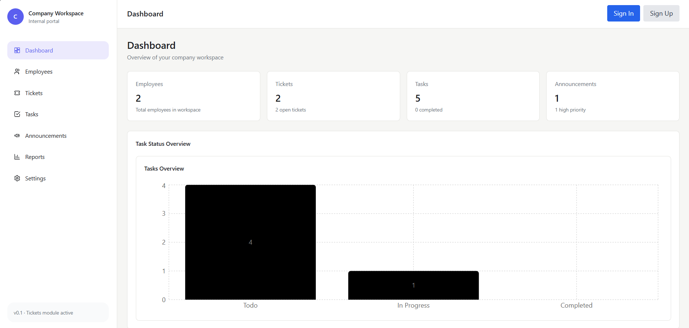
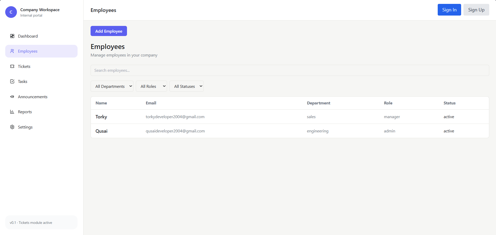
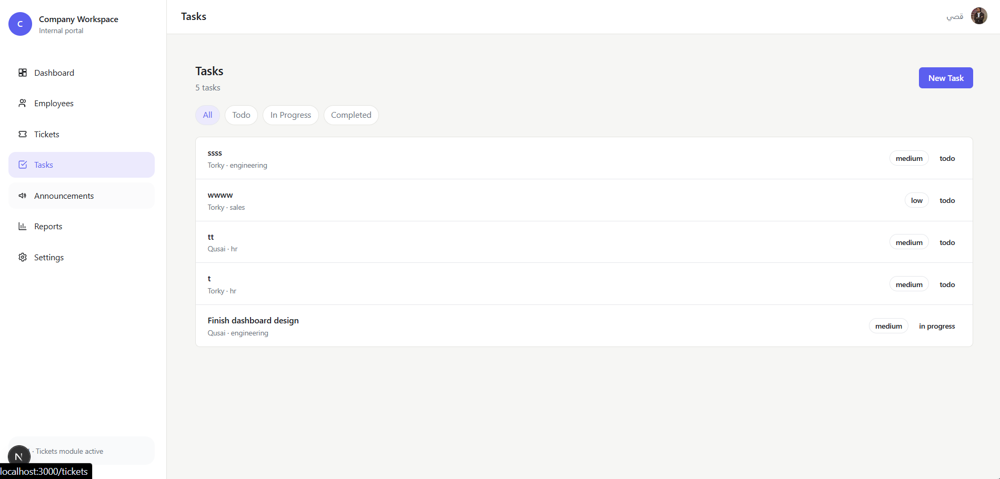
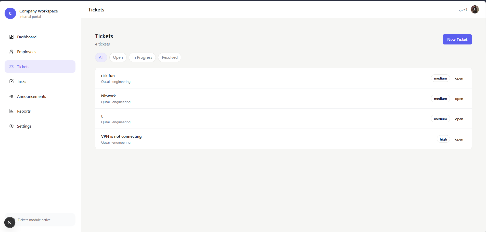

# Company Workspace

An internal company workspace for managing employees, tasks, support tickets, announcements, company settings, and reports.

Built with Next.js, TypeScript, Prisma, Neon PostgreSQL, and Clerk authentication.

## Live Demo

https://company-workspace-git-main-qusai-e-project1.vercel.app/

<!-- Add the deployed project link here. -->

## Screenshots









## Features

- Employee management with departments, roles, and account status.
- Task management: create, assign, update status, and delete tasks.
- Ticket management linked automatically to the signed-in employee.
- Company announcements with priorities.
- Company settings and individual user preferences.
- Dashboard and reports based on real database data.
- Clerk authentication linked to employee records in Neon.
- Role-based task permissions for `admin`, `manager`, and `employee` roles.

## Task Permissions

| Action             | Admin        | Manager                       | Employee            |
| ------------------ | ------------ | ----------------------------- | ------------------- |
| Create tasks       | Any employee | Employees in their department | Not allowed         |
| Update task status | Any task     | Tasks in their department     | Only assigned tasks |
| Delete tasks       | Any task     | Tasks in their department     | Not allowed         |

Inactive employees and Clerk accounts that are not linked to an employee record cannot create, update, or delete tasks.

## Tech Stack

- [Next.js](https://nextjs.org/) 16
- [React](https://react.dev/)
- [TypeScript](https://www.typescriptlang.org/)
- [Tailwind CSS](https://tailwindcss.com/)
- [Prisma ORM](https://www.prisma.io/)
- [Neon PostgreSQL](https://neon.tech/)
- [Clerk](https://clerk.com/)
- [Recharts](https://recharts.org/)

## Project Structure

```text
app/
├── (dashboard)/       # Dashboard pages and shared dashboard layout
├── api/               # Route handlers and protected server operations
└── layout.tsx         # Root layout and Clerk provider

components/
├── announcements/
├── dashboard/
├── employees/
├── layout/
├── settings/
├── tasks/
└── tickets/

lib/
├── modules/            # Prisma data functions grouped by feature
├── types/              # Shared TypeScript types
├── current-employee.ts # Clerk-to-Employee linking helper
└── prisma.ts           # Prisma client setup

prisma/
├── migrations/         # Database migration history
└── schema.prisma       # Database models and enums
```

## Getting Started

### 1. Clone the repository

```bash
git clone git@github.com:qusaideveloper2004-hub/Company-Workspace.git
cd Company-Workspace
```

### 2. Install dependencies

```bash
npm install
```

### 3. Create environment variables

Create a `.env` file in the project root:

```env
DATABASE_URL="your_neon_database_url"
NEXT_PUBLIC_CLERK_PUBLISHABLE_KEY="your_clerk_publishable_key"
CLERK_SECRET_KEY="your_clerk_secret_key"
```

Never commit `.env` to GitHub.

### 4. Apply database migrations and generate Prisma Client

```bash
npx prisma migrate deploy
npx prisma generate
```

### 5. Start the development server

```bash
npm run dev
```

Open [http://localhost:3000](http://localhost:3000).

## Available Scripts

```bash
npm run dev       # Start the development server
npm run build     # Create a production build
npm run start     # Start the production server
npm run lint      # Run ESLint
npx prisma generate
npx prisma migrate deploy
```

## Database Models

The project uses PostgreSQL through Neon with the following main models:

- `Employee`
- `Task`
- `Ticket`
- `Announcement`
- `CompanySettings`
- `UserPreference`

`Employee.clerkUserId` connects a Clerk account to its matching employee record in the database.

## Current Development Status

Completed:

- Database migration from static data to Neon PostgreSQL.
- Prisma data layer and API routes for core modules.
- Clerk-to-Employee linking.
- Task authorization for roles and departments.

Planned improvements:

- Authorization for Tickets, Announcements, Employees, and Settings.
- Zod validation for API request data.
- Applying saved theme preferences to the UI.
- More detailed reports.
- Production deployment.

## Author

Built by [Qusai Essam](https://github.com/qusaideveloper2004-hub).
